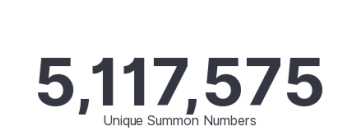
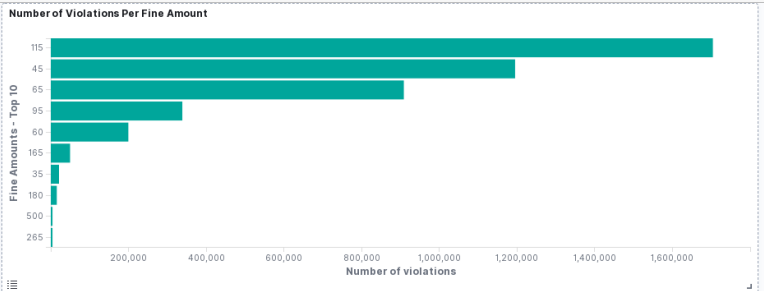
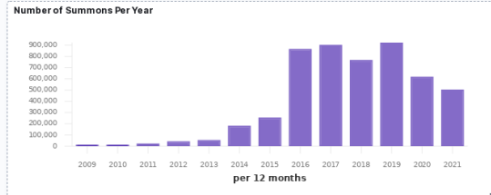
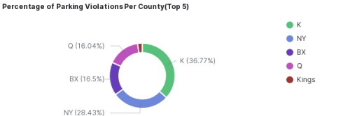
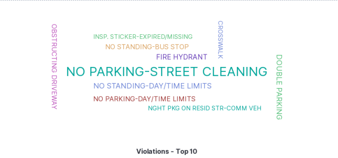
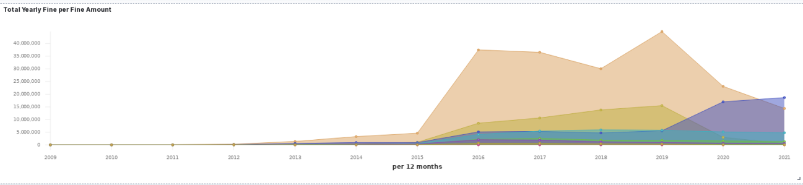

# Project 1: Ingesting Parking Violations Data into Elasticsearch
For this project I loaded 5 million rows of parking violation data from NYC Open Data to Elasticsearch. In order to do so, I provisioned two AWS's t2.xlarge EC2 instances and ran multiple containers inside each instance. To run the containers I had to build a docker image.

## To build a docker image I used the following command:
```{python}
docker build -t project01:1.0 project01/
```

And to run the containers I had run the docker image. Each container pushed 200,000 documents to the Elasticsearch index called "violation". Also, everytime I ran a new container I changed the value for num_pages to recompute the offset.

## To run the docker image I used the following command:

```{python}
docker run -v $PWD:/app \ 
	-e DATASET_ID="nc67-uf89" \
	-e APP_TOKEN="APP TOKEN" \
	-e INDEX_NAME="violation" \
	-e ES_HOST="HOST" \
	-e ES_USERNAME="USER NAME" \
	-e ES_PASSWORD="PASSWORD" \
	-d project01:1.0 python src/main.py --page_size=200000 
        --num_pages=1
```

As for the python script, you can see that on line 63, which is given below, I have a loop. However, because I was parallelizing the process using multiple containers and EC2 instances, the loop would have resetted the offset resulting in duplicates. So, I removed this loop while I loaded the rows.

## Removed the loop to avoid duplicates
```{python}
 for page in range(0,args.num_pages):
        rows = client.get(DATASET_ID, limit= args.page_size,
        order = "summons_number", 
        offset =page*args.page_size) # rows
```

## Visualizing the data
After the rows were uploaded, I visually analysed the data in Kibana. I created a total of 6 visualizations. I used tag cloud, metric, TSVB, horizontal bar, pie, to create them. Please note that the missing values were exlcuded. Below are the visualizations:

### Figure 1: Unique Summons


### Figure 2: Number of Violations Per Fine Amount


### Figure 3: Number of Summons Per Year


### Figure 4: Percentage of Parking Violations Per County


### Figure 5: Top 10 Violations


### Figure 6: Total Yearly Fine Per Fine Amount


## Conclusion
For this project I uploaded more then 5 five million unique rows to Elasticsearch as can be seen in Figure 1. From the analysis in Kibana we know that:

- \$115 was charged for the most parking violations followed by \$45 (Figure 2)
- Most summons were issued in years 2016, 2017 and 2019 (Figure 3)
- Most summons were issued in counties k and NY (Figure 4)
- Most common violations include "no parking street-cleaning", "no standing-day/time limits", "crosswalk", "double parking" etc. (Figure 5)
- The total yearly amount for the fine amount of \$115 was the highest from 2012 - 2020, but towards the end of 2020 we see the total yearly amount for fine amount of \$65 is surpassing it (Figure 6)
