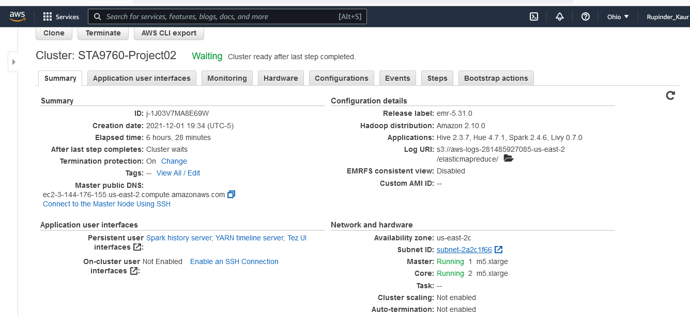
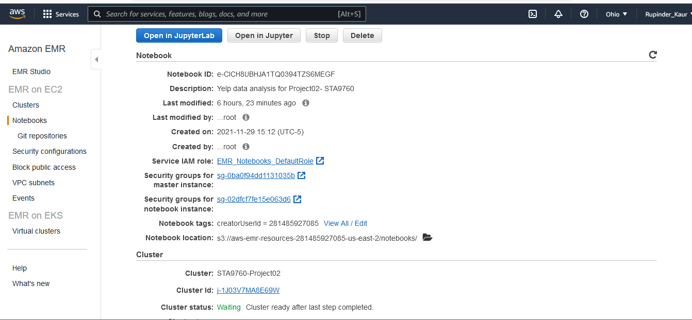

# Project 2: Analyzing 10Gb of Yelp Data

We analyzed Yelp's business, review and user data from [Kaggle](https://www.kaggle.com/yelp-dataset/yelp-dataset#yelp_academic_dataset_user.json) for this project. I uploaded the dataset to AWS'S S3 bucket and then loaded it to jupyter notebook using Spark, as shown below for the review data:

```{python}
review = spark.read.json("s3://sta9760-spark-yelp-dataset/Yelp_Data/yelp_academic_dataset_review.json")
```
## Technologies leveraged
* AWS
    * S3
    * EMR- Spark, Jupyter Notebook

## Configurations
### Cluster Configuration


### Notebook Configuration

