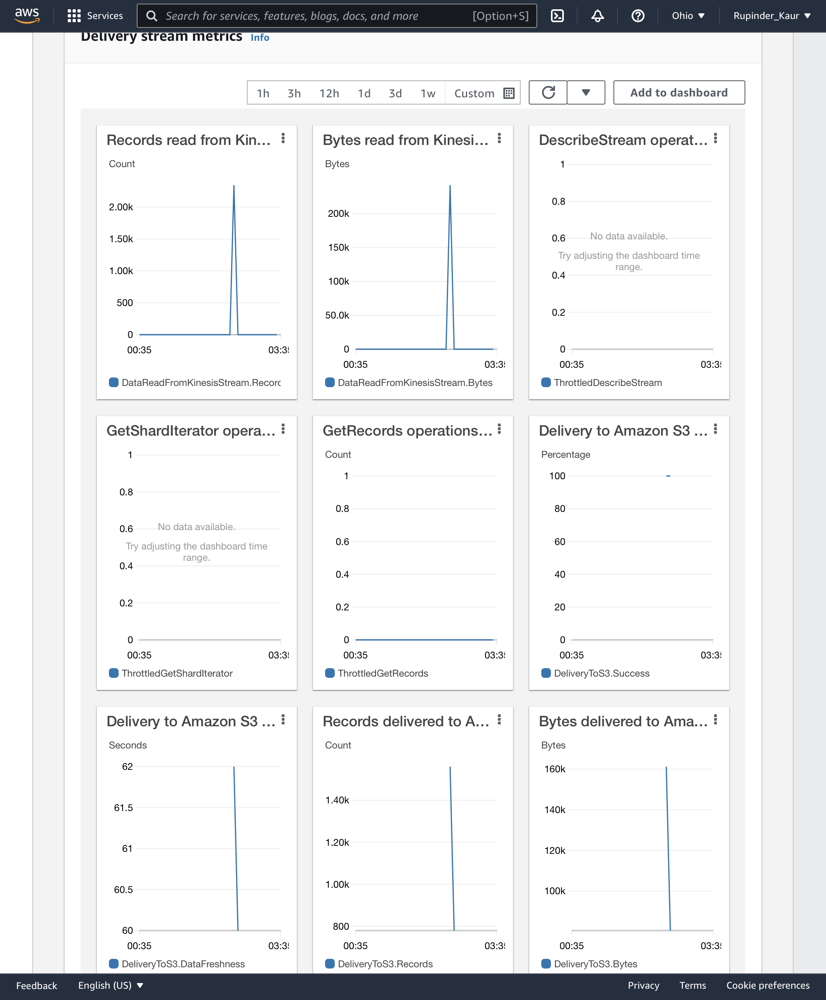
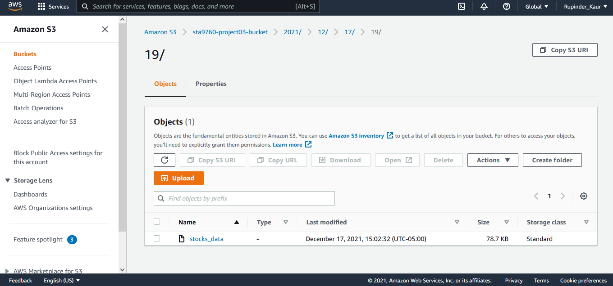

# Streaming Finance Data with AWS Lambda
For this project, we wrote a lambda function that uses the yfinance module to grab the November 30th stock data for the following companies:
- Facebook, Shopify, Beyond Meat, Netflix, Pinterest, Square, The Trade Desk, Okta, Snap, Datadog 

A subset of this data is then converted to json format and placed into kinesis delivery stream, which points to the S3 bucket, where the data gets stored. We then configured AWS Glue crawler that created a database with tables from the data stored in S3. Finally, we used AWS Athena to query the data and downloaded the output of this query to create a few visulizations in jupyter notebook.

## Technologies Leveraged
- AWS
    - Lambda
    - Kinesis
    - S3
    - Glue
    - Athena
- Jupyter Notebook

## Kinesis Data Firehose Delivery Stream Monitoring

## S3 Bucket

